# **Dirt Be Gone - Residential cleaning & handyman services**

## **Introduction**

The Dirt Be Gone website was created and built by Stephen Mc Govern. The aim of the website is to provide people who live in the Dublin area with easy online access to a range of residential cleaning and handyman services offered by the Dirt Be Gone company. 

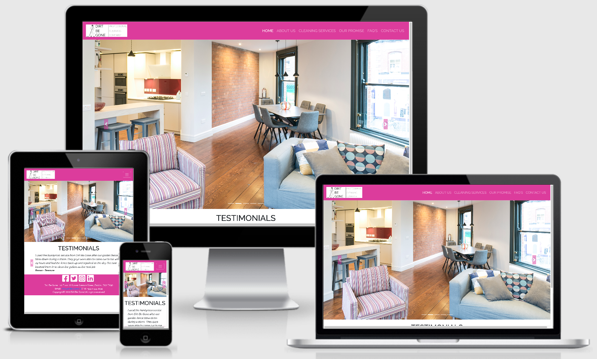

## **Table of contents** 

### **1. User Experience (UX)**
  * 1.1 Target audience
  * 1.2 Visitor goals
  * 1.3 Business goals
  * 1.4 User stories
  * 1.5 Design choices
  * 1.6 Wire frames

### **2. Features**
  * 2.1 [The Navbar](#2.1-the-navbar)
  * 2.2 The Footer
  * 2.3 The Hero Image
  * 2.4 Testimonials
  * 2.5 About Us
  * 2.6 Cleaning Services
  * 2.7 Our Promise
  * 2.8 FAQ'S
  * 2.9 Contact Us 
  * 2.10 Features Left To Implement

### **3. Technologies/Languages Used**
  * 3.1 Gitpod
  * 3.2 HTML5
  * 3.3 CSS
  * 3.4 Bootstrap (Version 4)
  * 3.5 Google fonts 
  * 3.6 Font Awesome 
  * 3.7 YouTube
  * 3.8 External hyperlinks
  * 3.9 Balsamiq

### **4. Testing**
  * 4.1 See [testing.md](testing.md) document 

### **5. Deployment**

### **6. Credits**
  * 6.1 Media
  * 6.2 Code
  * 6.3 Acknowledgements

### **7. Contact**
  * 7.1 LinkedIn
  * 7.2 Email
  * 7.3 Skype

### **8. Disclaimer**

 * 8.1 Disclaimer
>
## **1. User Experience (UX)**

### **1.1 Target Audience**

####  This website is aimed at anyone who:

* Owns, manages, or rents a residential property in the Dublin area that needs the use of a cleaner, housekeeper or handyman.

### **1.2 Visitor goals** 

* To allow visitors to the site to get some more background information about the company and to see what type of business services they offer the general public. On the cleaning services page users can select the type of service they are interested in and then submit a request for the company to contact them. 

### **1.3 Business goals**

* The whole aim of the site is to get users to browse the services offered by the company and if they are interested in a service to submit an enquiry so the company can offer quotes for business. 

### **1.4 User Stories**

As a visitor to the company website i expect/want/need

**I am a home owner and i have a large family. Doing the ironing for 5 children, myself and my husband takes up an awful lot of my time. I would like someone to take this weekly chore off my hands so i can spend more quality time with my family.**

* **(Expect/Want/Need)** I want to be able to get information on the company and the services they offer, and to then enquire about using a weekly housekeeper to do the ironing for my family, and know what this will cost me at an hourly rate. 

**Walkthrough**

This user lands on the Dirt Be Gone homepage. The Navbar at the top of the screen is clearly laid. The user wants to know a bit more about the company so they click on the about use section

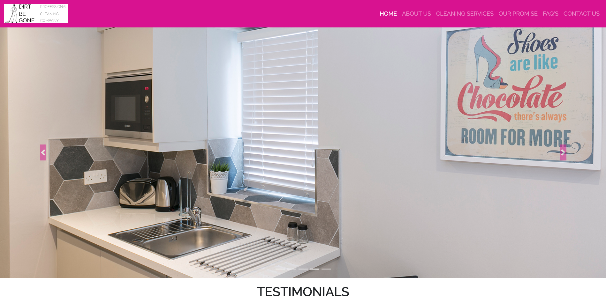 

The user reads up on the company and their mission statement and can see they have been in business for six years now, so believes they must offer a good service if they have been trading six years.

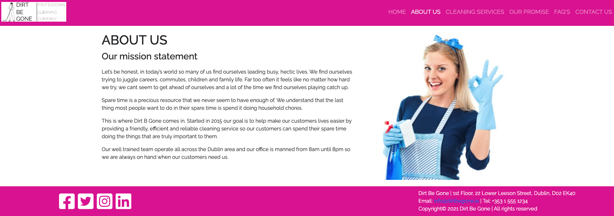 

The user also wants to know that she will be safe letting a person she has never met into her home. The user then clicks on the our promise link to see what the company is promising customers. The user can see that all of the cleaners have had a full background check carried out on them so feels more secure in using the company now. 

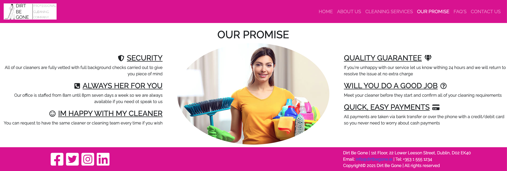 

After reading a bit more about the company the user clicks on the cleaning services page and is presented with a list of all of the cleaning services that the company offers. As the user scrolls down through the services they see the ironing service in the bottom left card with the hourly rate. The user clicks on the click to contact us for a quote link.

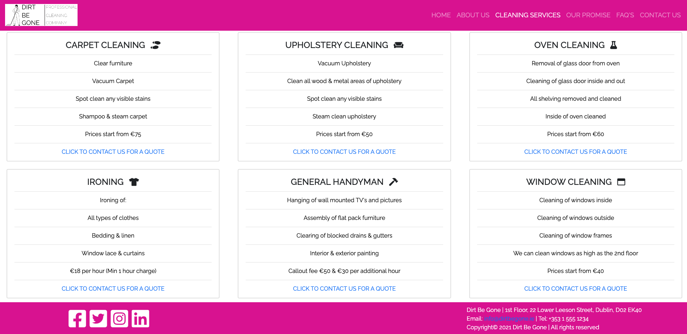 

The user is presented with 5 entry fields and 1 free text box. They can see which fields are required. The user populates the form with the information required and also some free text about what they are looking for. They have also selected the specialist services radio button. They then press send message.

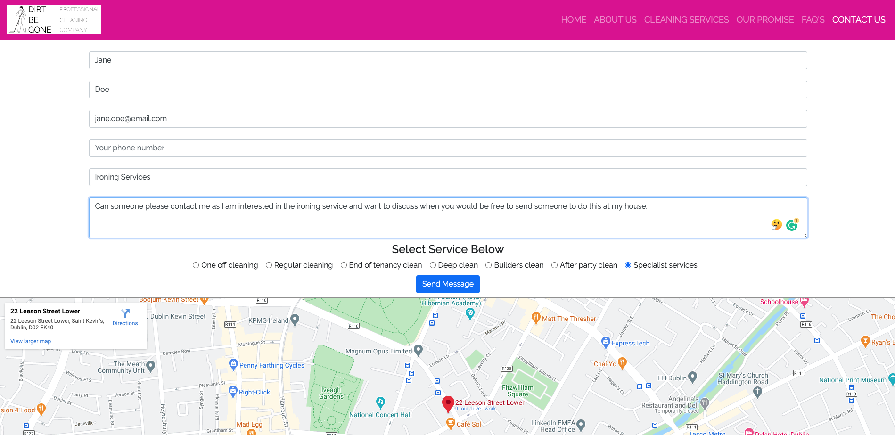 

The users message has been successfully received and they see a confirmation message letting them know someone from the team will be in contact. 

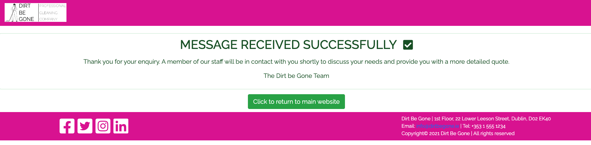

* **(Measurement for success)** This would result in an incoming enquiry from a customer looking to purchase this service. 

**I am a property manager who manages 100 residential properties in the Dublin area. At one of the properties i manage the back garden fence has blown down during a storm and i need a handyman to call out to the property and repair the fence.**

* **(Expect/Want/Need)** I need to locate a company that provides handyman services in the Dublin area. I need to get a rough idea of cost of the repair. I estimate the job should take no more than two  hours to complete as there isn't any major damage to the fence as no panels are broken, just the posts that hold them in place. I need to speak to the company so i can schedule a date for the repair to be carried out. 

* **(Measurement for success)** This would result in an incoming enquiry from a customer looking to purchase this service. 

**I own a buy to let rental property. My current tenant who has been with me for 3 years is moving out of the property at the end of the month and i need it deep cleaned before i can start doing viewings with new potential tenants.**

* **(Expect/Want/Need)** After they move out I need to get the property deep cleaned before i can start advertising it again and holding viewings with new potential tenants. 

* **(Measurement for success)** This would result in an incoming enquiry from a customer looking to purchase this service. 

### **1.5 Design choices** 

I wanted the website to have a bright and clean feel to it. Its for a cleaning company so i decided on bright clean colours. I didn't want lots of clutter on the pages as this can be common with websites for this type of business. I also wanted the site to be easy to navigate.

#### FONTS

* I decided i would use the Google fonts [Raleway](https://fonts.google.com/specimen/Raleway?query=rale) & [Lato](https://fonts.google.com/specimen/Lato?query=lato) for this project. I chose these two fonts as modern, clean, easy to read and look well on both desktop and mobile devices.

#### ICONS

* I also decided i would use font awesome icons throughout the site. I did this because i believe icons make a site look better and also give the user an idea of the type of information that they are looking at.

* I also used font awesome for the companies social media icons (Facebook, Twitter, Instagram, LinkedIn) located in the footer of the page. 

#### COLOURS

* I did some research as to what colours would be best to use for a cleaning company. A lot of the information i found from my web searches said that bright colours work well as they convey a bright/clean feel to them. Also white is the colour that is most associated with cleanliness, clean white sheets for example, so i wanted to incorporate white into the site as if it were a blank white canvas. 
 

* The text is written in black as this is the colour that contrasts the best with a white background. 
 

* For my hyperlinks i wanted to use the standard blue that people are familiar with when browsing a website.
 

* Finally on the FAQ page i decided to use a light grey background for the question, and a white background for the answer. I initially went for an white background on both but i found that it was hard on the eyes to differentiate between the question and the answer, so i went with a grey background. 
 

* The main colour pallet can be found below. 

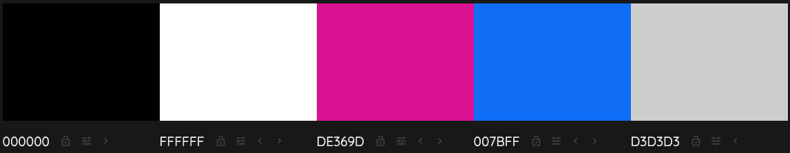

* I used the website colour mind when deciding on which colours to use. The website uses a generator to help you select the best matching colour palettes for your project. The website can be found here:  
[Colour Mind Website Here](http://colormind.io/)

### **1.6 Wire Frames** 

[Homepage Desktop](https://ibb.co/FXqfZ2d) 
[Homepage Mobile](https://ibb.co/jTKg8HN) 
[About Us Desktop](https://ibb.co/kMMdRGY) 
[About Us Mobile](https://ibb.co/JdCHN2h) 
[Cleaning Services Desktop](https://ibb.co/c18hbxd) 
[Cleaning Services Mobile](https://ibb.co/7Sc3r1h) 
[Our Promise Desktop](https://ibb.co/NxJbYtC) 
[Our Promise Mobile](https://ibb.co/3zybq29) 
[FAQ Desktop](https://ibb.co/k5csMF5) 
[FAQ Mobile](https://ibb.co/TT4Z5Dz) 
[Contact Us Desktop](https://ibb.co/Ln31KMw) 
[Contact Us Mobile](https://ibb.co/FmNvxnZ)
>
## **2. Features**

### **2.1 The Navbar**

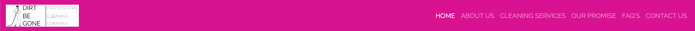

* The Navbar i decided to use a standard Bootstrap 4.4 Navbar with brand. I did this because i wanted the company logo in the top left, and the menu items on the right. The menu items i decided on were 

1. Home
2. About Us
3. Cleaning Services 
4. Our Promise 
5. FAQ
6. Contact us

The site also needs to be mobile responsive so i chose Bootstrap as it provided me with a quick and easy way of achieving this. On smaller screen sizes the navbar will collapse into a hamburger menu that when clicked will expand and reveal the nav bar items. 

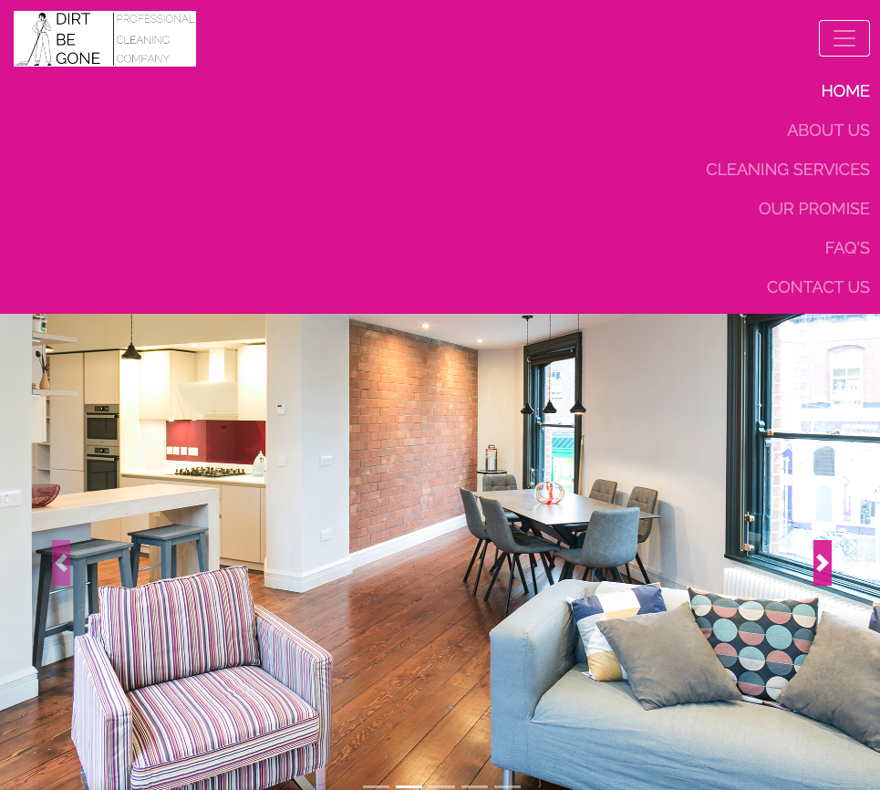

### **2.2 The Footer** 

* In the footer i have listed all of the companies contact details and also put all of the companies social media links. The navbar and the footer are identical on each page as to maintain cohesion no matter what page the user finds themselves on. 

### **2.3 The Hero image**

* I wanted to use some great images here, so i have used a bootstrap carousel to show several images of different property interiors that are very clean to show the standard the cleaners work to. 

### **2.4 Testimonials**

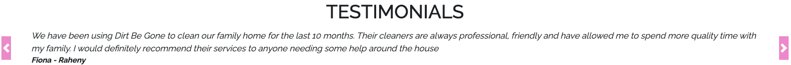

* I have also used another bootstrap carousel below the hero images for customer reviews and testimonials. I also added a control next and control previous icon which allows users to browse forward and backward through the testimonials.  

### **2.5 About Us Page**

* Allows any user to read more information on the company, when the were set up, why they were set up, and what their mission statement is. Here i have used some header tags, some paragraphs, and an image of a cleaner. 

### **2.6 Cleaning Services Page**

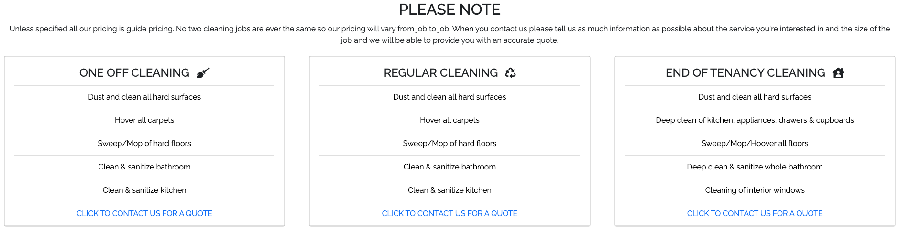

* On this page users can browse all of the services offered by the company. There is also some additional information on pricing for some services. Users can browse the services that they are interested in purchasing and directly from here click a link to be directed to the contact us form. Here they provide their contact details and also have the ability to enter some additional information about the service they are interested in. I decided to use Bootstrap cards for this section.

### **2.7 Our Promise Page**

* Before purchasing a service from the company potential customers can read this section and know what kind of level of service they can expect and the standards the company promise to achieve. I used an image of a cleaner for the center of the page and some headers and text around the image. On smaller screen sizes the image disappears and only text is displayed.  

### **2.8 F.A.Q Page**

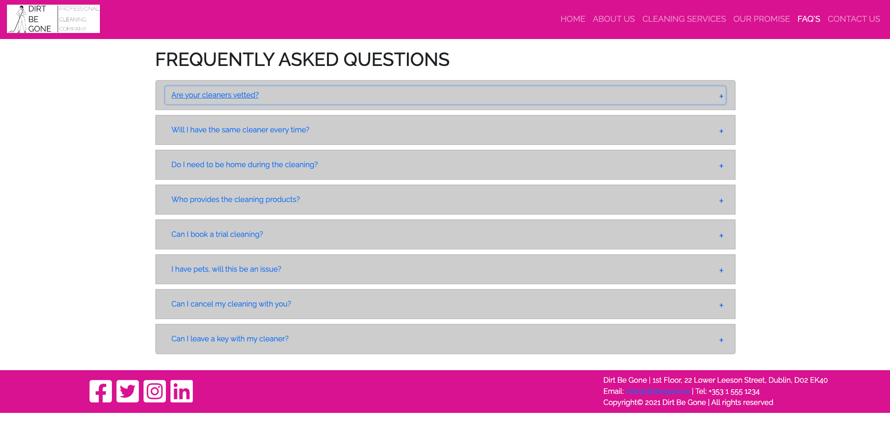

* Lots of customers will always have a few questions about a product or service before they buy it. By adding this section to the website it allows us the potential customer to see if their question is here, and if so, to have it answered. This means the customer doesn't have to call the office number so it will save staff time answering the same kind of questions over and over again. Here i have used a Bootstrap accordion. 

### **2.9 Contact Us Page**

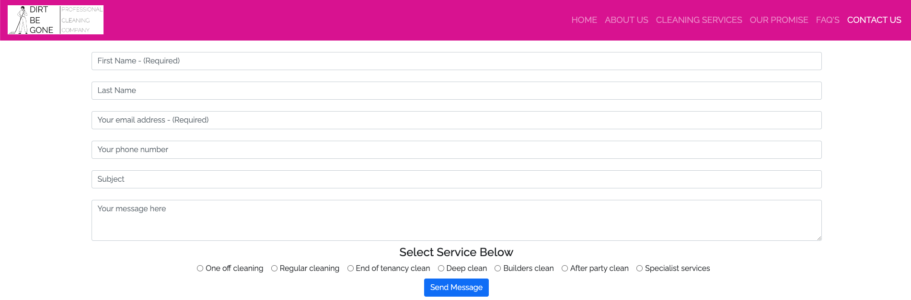

* Once a user has selected the type of service they are interested in purchasing they will be directed to the contact us page. Users can also get to this page directly from the Navbar. The aim of the site is to drive users to this page so they can submit their contact details so the company can begin the sales process and begin quoting for business. The companies office address is also displayed via a Google map. 

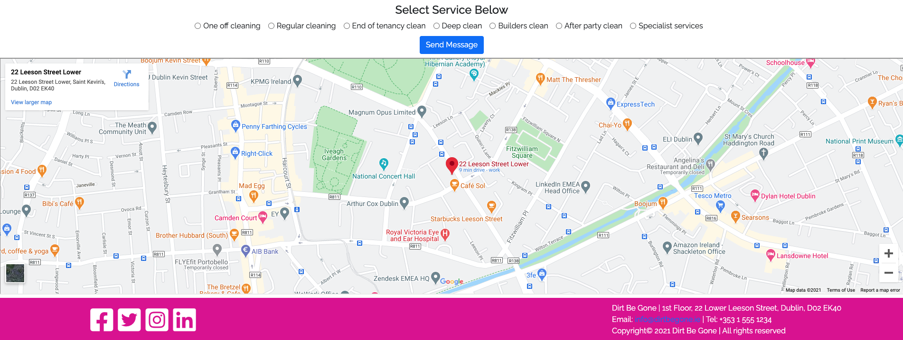

### **2.10 Features Left To Implement**

1. An online booking engine where customers can select the type of service they wish to use, and select the date and time they wish that service to start. 
2. An online payment option so people can make payment for the service they wish to purchase 
3. An invoicing system where the company can email invoices to customers that contains a payment link so they can pay online after the job is completed and payment is due. 
4. A customer account and log in where customers can review all of their account details such as the name on their account, their current address, past services purchases, and any current services running (Example: weekly cleaning service)  
>
## **3. Technologies/Languages Used**

3.1 [Gitpod](https://www.gitpod.io/) - Is the IDE recommended for Code Institute students and the one i chose to develop this project in. 
3.2 [HTML5 - Hypertext Markup Language](https://html.com/html5/#What_is_HTML) - This is the markup language i used for this project. 
3.3 [CSS - Cascading Style Sheet](https://en.wikipedia.org/wiki/CSS) - I used CSS to help alter and adjust the presentation of the website to create a pleasant user experience. 
3.4 [Bootstrap](https://getbootstrap.com/) - Bootstrap is the most popular CSS Framework for developing responsive and mobile-first websites. Bootstrap 4 is the version i used for the development of this project.
3.5 [Google fonts](https://fonts.google.com/) - Launched in 2010 Google Fonts is a library of 1,023 free licensed font families. 
3.6 [Font Awesome](https://fontawesome.com/) - Font Awesome is a font and icon toolkit based on CSS and Less. It was made by Dave Gandy for use with Bootstrap, and later was incorporated into the BootstrapCDN. Font Awesome has a 38% market share among those websites that use third-party font scripts on their platform. 
3.7 [YouTube](https://www.youtube.com/) links - I used a link to a product review that is hosted on YouTube about a product that the company Dirt Be Gone offered to customers.  
3.8 [External Link](https://keysafe.co.uk/c500-keysafe.html#:~:text=The%20Supra%20C500%20coded%20Key,box%2C%20then%20look%20no%20further) - to a third party website that has all of the technical details about a product that Dirt Be Gone offers to customers. 
3.9 [Balsamiq](https://balsamiq.com/wireframes/?gclid=CjwKCAiAi_D_BRApEiwASslbJ_NXgCJLhWQ06W9sA_HcnQ4agJM5EJa4wWRNrXu6oJbIoz_zaiVBaRoCAScQAvD_BwE)- Balsamiq Wireframes is a rapid low-fidelity UI wireframing tool that reproduces the experience of sketching on a notepad or whiteboard.
>
## **4. Testing**

* Testing information can be found in the [testing.md](testing.md) file
>
## **5. Deployment**
>
## **6. Credits** 

### **6.1 Media** 

 * All images of the apartments used in the carousel on the home page were provided by [Dublin City Rentals](https://dublincityrentals.com/)
* Image of the cleaner on the about us page belongs to 
* Image of the cleaner on the our promise page belongs to

### **6.2 Code** 

* Majority of the code i used was Bootstrap. Their [main documentation](https://getbootstrap.com/docs/5.0/getting-started/introduction/) had lots of great information. 
* I also came across this great bootstrap [cheat sheet](https://hackerthemes.com/bootstrap-cheatsheet/) online which i also used quite a bit. A big thanks to [HackerThemes](https://hackerthemes.com/) for making this available free online.
* For the FAQ page i wanted to use the accordion effect that Bootstrap offers. I came across [this video tutorial](https://www.youtube.com/watch?v=t5pJ-SYCZa0) on YouTube and used it for guidance to achieve the effect i wanted. A big thanks to the team over at [Easy Tutorials](https://www.youtube.com/channel/UCkjoHfkLEy7ZT4bA2myJ8xA) for posting the guide.

### **6.3 Acknowledgements**

* A huge thank you to all of the tutor team at Code Institute who were always on hand whenever i needed their support.
* A big thank you to my mentor Dick Vlaanderen who gave me great feedback on my initial ideas for the project.
* A final big thank you to all of the other students, CI alumni and CI staff who were always willing to help out and advise on the official CI Slack channels.
>
## **7. Contact**

Feel free to contact me on any of the following channels: 

7.1 [LinkedIn](https://www.linkedin.com/in/stephenmcgovern01/) 
7.2 [Email](mailto:stephen_xyz1@hotmail.com) 
7.3 [Skype](https://join.skype.com/invite/ndruMu7qVuKZ)
>
## **8. Disclaimer**

### **8.1 Disclaimer**   

This website and all of its content is for educational purposes only.
>