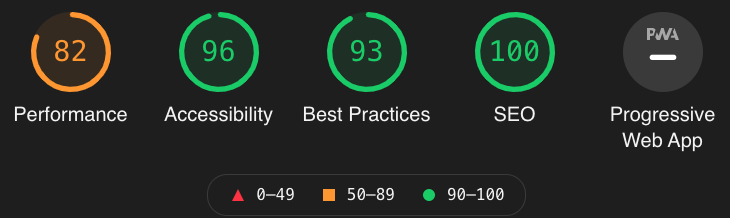

# **Dirt Be Gone - Testing Details**

Main [README.MD](readme2.md) file 

## **Table of contents** 

### **1. Automated Testing**
 * 1.1 Validation Testing
 * 1.2 Lighthouse Testing 

### **2. Manual Testing**
  * 2.1 Manual Testing Desktop
  * 2.2 Manual Testing Tablet/Mobile
>
## **1. Automated Testing**

### **1.1 Validation Testing** 

For validation testing i used the following: 

 * HTML - [W3C Markup Validation Service](https://validator.w3.org/#validate_by_input) 
 * CSS - [W3C CSS Validation Service](https://jigsaw.w3.org/css-validator/#validate_by_input)

### **1.2 Lighthouse Testing** 

I also used the Google Chrome tool Lighthouse for the testing of the website and its performance. After running lighthouse the results of the test for the website came back as:

>
## **2. Manual Testing**

### **2.1 Manual Testing - Desktop** 

All desktop testing was carried out on Chrome, FireFox and Safari.

**1. Navbar** 
  * Hover over each link, confirm the hover effect works for each item.
  * Click the Dirt Be Gone logo, can confirm it takes the user to the home page.
  * Click the About Us link, can confirm it takes the user to the About Us page.
  * Click the Cleaning Services page link, can confirm it takes the user to the Cleaning Services page.
  * Click the Our Promise page link, can confirm it takes the user to the Our Promise page.
  * Click the FAQ's page link, can confirm it takes the user to the FAQ's page.
  * Click the Contact Us page link, can confirm it takes the user to the Contact Us page.

**2. Footer**
  * Have clicked on all of the social media icons (Facebook, Twitter, Instagram, LinkedIn) and can confirm they take you to the correct page that opens in an external tab. 
  * Clicked on the email address link, can confirm it opens up my browser email client. 

**3. Homepage** 
  * Confirm that hero images load at a reasonable speed, and that the images are sharp, clear and in proportion.
  * The Testimonials also load at a reasonable speed and are clear and easy to read. 
  * Both the image carousal and testimonials carousal have forward and backward controllers that are working that allow users to cycle forwards and backwards through the images.  

**4. About Us**
  * The heading, paragraphs and image of the cleaner are all dynamic and adjust as desired depending on the screen size.
  * The image of the cleaner will disappear completely on smaller screen sizes.

**5. Cleaning Services**
  * All of the Bootstrap cards are loading correctly underneath the page heading and the guide pricing paragraph as normal. 
  * Font awesome logos are also all loading correctly and maintaining the correct padding to keep them spaced out from the h4 heading 
  * All of the click to contact us for a quote links are all working correctly and are diverting users tot he contact us page as desired. 

**6. Our Promise** 
  * Have adjusted the page and can confirm the image is dynamic and adjusts its size accordingly as the screen shirks. The image will also disappear on medium and small devices. On mobile phones the image will return and take up a row all of its own. 

**7. FAQ's**
  * I used the bootstrap accordion effect for this section. I have tested every question and answer and can confirm that all of the items expand and collapse when they are clicked 
  * In the answer section of the "Can i leave a key with my cleaner" question i have used to external links. One of them is to the key safe company and they other link is to a YouTube video. Can confirm that both of the links are working and they both open in an external tab. 

**8. Contact Us**
  * On the form i have set the first name and email address to required. I have attempted to send a message without completing these fields and can confirm that the form will not send until these fields are populated.
  * The google map is able to be dragged and moved and zoomed in and out by users.
  * I have also clicked on the directions icon on the map and it opens google maps in a new tab with the correct destination, users would only need ot add their starting point.
  * I have also clicked the "view larger map" link on the map and again it opens the map in a new tab and the destination is correctly set. The user just need sot enter their starting address.
  * After the form has been correctly completed and the user presses send message the user is them brought to a confirmation page that confirms the business has received their message and will contact them. 
  * On the confirmation page there is also a button the user can click to bring them back to the main site. I have tested this and can confirm it does bring you back tot he main site.  

### **2.2 Manual Testing - Tablet/Mobile** 

All mobile testing was carried out on google Chrome and FireFox on the following devices:

iPad (Horizontal & Vertical)   
iPad Pro (Horizontal & Vertical)  
Chuwi Hi9 Pro Tablet (Horizontal & Vertical)  
iPhone 6/7/8 iPhone X (Horizontal & Vertical)  
Huawei P20 lite (Horizontal & Vertical)  
Huawei P Smart (Horizontal & Vertical) 

**1. Navbar** 
  * The page the user is on is highlighted with slightly brighter text in the menu when the tablet device is held horizontal. 
  * Click the Dirt Be Gone logo, can confirm it takes the user to the home page.
  * Click the About Us link, can confirm it takes the user to the About Us page.
  * Click the Cleaning Services page link, can confirm it takes the user to the Cleaning Services page.
  * Click the Our Promise page link, can confirm it takes the user to the Our Promise page.
  * Click the FAQ's page link, can confirm it takes the user to the FAQ's page.
  * Click the Contact Us page link, can confirm it takes the user to the Contact Us page.

**2. Footer**
  * Have clicked on all of the social media icons (Facebook, Twitter, Instagram, LinkedIn) and can confirm they take you to the correct page that opens in an external tab. 
  * Clicked on the email address link, can confirm it gives me the choice of email client i wish to send the email from.

**3. Homepage** 
  * Confirm that hero images load at a reasonable speed, and that the images are sharp, clear and in proportion.
  * The Testimonials also load at a reasonable speed and are clear and easy to read. 
  * Both the image carousal and testimonials carousal have forward and backward controllers that are working that allow users to cycle forwards and backwards through the images.  

**4. About Us**
  * On a tablet that is held horizontally the image of the cleaner is showing as intended. On mobile phones and tablets held vertically the image disappears. 

**5. Cleaning Services**
  * All of the Bootstrap cards are loading correctly underneath the page heading and the guide pricing paragraph as normal. 
  * Font awesome logos are also all loading correctly and maintaining the correct padding to keep them spaced out from the h4 heading 
  * All of the click to contact us for a quote links are all working correctly and are diverting users tot he contact us page as desired. 

**6. Our Promise** 
  * On a tablet hel horizontally the image of the cleaner appears as normal. When the tablet is held vertically the image disappears. 
  * On mobile phones the image of the cleaner will not appear which is what we wanted. 

**7. FAQ's**
  * I used the bootstrap accordion effect for this section. I have tested every question and answer and can confirm that all of the items expand and collapse when they are clicked 
  * In the answer section of the "Can i leave a key with my cleaner" question i have used to external links. One of them is to the key safe company and they other link is to a YouTube video. Can confirm that both of the links are working. The YouTube video link opens the YouTube app on mobile devices. The other link opens the page on an external tab. 

**8. Contact Us**
  * On the form i have set the first name and email address to required. I have attempted to send a message without completing these fields and can confirm that the form will not send until these fields are populated.
  * The google map is able to be dragged and moved and zoomed in and out by users who need ot use 2 fingers to do this. The two finger requirement is displayed on the map in text form so people will know how to move the map.
  * I have also clicked the "view larger map" link on the map and again it opens the map in google maps and the destination is correctly set. The user just needs to enter their starting address.
  * After the form has been correctly completed and the user presses send message the user is them brought to a confirmation page that confirms the business has received their message and will contact them. 
  * On the confirmation page there is also a button the user can click to bring them back to the main site. I have tested this and can confirm it does bring you back tot he main site.  
>